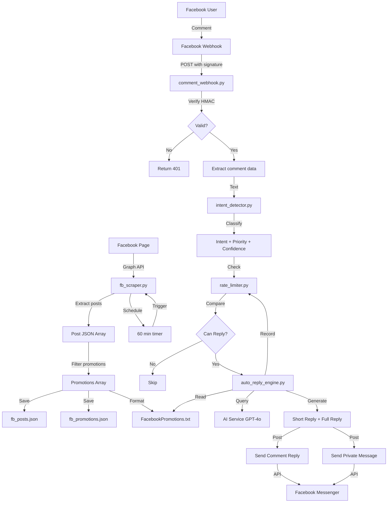

# 📊 วิเคราะห์อบรรณ ระบบ Facebook Integration

**วันที่วิเคราะห์:** 6 มีนาคม 2026  
**ระบบ:** Seoulholic Multi-Platform Chatbot  
**หมวดหมู่:** Facebook Integration Module  

---

## 📑 สารบัญ

1. [ภาพรวมระบบ](#ภาพรวมระบบ)
2. [สถาปัตยกรรม](#สถาปัตยกรรม)
3. [คำอธิบายโมดูล](#คำอธิบายโมดูล)
4. [ขั้นตอนการทำงาน](#ขั้นตอนการทำงาน)
5. [การรวมระบบ](#การรวมระบบ)
6. [ข้อมูล Configuration](#ข้อมูล-configuration)
7. [Flow Diagram](#flow-diagram)
8. [ปัญหาและข้อเสนอแนะ](#ปัญหาและข้อเสนอแนะ)

---

## ภาพรวมระบบ

### 🎯 วัตถุประสงค์
ระบบ Facebook Integration ถูกออกแบบเพื่อให้ Chatbot ของ Seoulholic Clinic สามารถ:

1. **ดึงข้อมูลโปรโมชั่น** จาก Facebook Page อัตโนมัติ
2. **ตอบกลับความเห็น** (Comments) บน Facebook บอทโดยอัตโนมัติ
3. **จำแนกประเภท** (Intent Detection) ของแต่ละคำถามเพื่อให้คำตอบที่เหมาะสม
4. **จัดการอัตราการตอบ** (Rate Limiting) เพื่อป้องกัน Spam

### 📊 สถานะปัจจุบัน
- **โครงสร้าง:** เสร็จสมบูรณ์ 80%
- **การเชื่อมต่อ API:** ทำงานได้พื้นฐาน
- **ฟีเจอร์พิเศษ:** บางส่วนที่ระหว่างการพัฒนา

---

## สถาปัตยกรรม

### 🏗️ โครงสร้างที่สูง (High-Level Architecture)

```
┌─────────────────────────────────────────────────────────────┐
│              FACEBOOK INTEGRATION SYSTEM                      │
├─────────────────────────────────────────────────────────────┤
│                                                              │
│  ┌─────────────────┐         ┌──────────────────────────┐  │
│  │  Facebook API   │◄────────│ Auto Updater + Scraper   │  │
│  │  (Graph v18.0)  │         │ (ทุก 60 นาที)            │  │
│  └────────┬────────┘         └──────────────────────────┘  │
│           │                                                  │
│           ├──► Posts/Promotions ──► fb_posts.json          │
│           │                      ──► fb_promotions.json    │
│           │                      ──► FacebookPromotions.txt│
│           │                                                  │
│           └──► Comment Events                               │
│                      │                                       │
│                      ▼                                       │
│           ┌──────────────────────┐                         │
│           │ Comment Webhook      │                         │
│           │ (Receives Events)    │                         │
│           └──────┬───────────────┘                         │
│                  │                                          │
│           ┌──────▼──────────┐                              │
│           │ Intent Detector │                              │
│           │ (Classification)│                              │
│           └──────┬──────────┘                              │
│                  │                                          │
│           ┌──────▼──────────────┐                          │
│           │ Auto Reply Engine   │                          │
│           │ (AI Generation)     │                          │
│           └──────┬──────────────┘                          │
│                  │                                          │
│        ┌─────────┴──────────┐                              │
│        ▼                    ▼                               │
│    ┌────────┐          ┌──────────┐                        │
│    │Comment │          │ Send DM  │                        │
│    │Reply   │  Rate    │ Message  │                        │
│    │(Public)│─Limiter─│(Private) │                        │
│    └────────┘          └──────────┘                        │
│                                                              │
└─────────────────────────────────────────────────────────────┘
```

### 📁 โครงสร้างไฟล์

```
facebook_integration/
├── __init__.py                 # Package initialization
├── README.md                   # Documentation
├── fb_scraper.py              # ดึงข้อมูลจาก Facebook
├── auto_updater.py            # อัปเดตอัตโนมัติ (scheduler)
├── comment_webhook.py         # ตัวรับคำขอจาก Facebook
├── intent_detector.py         # จำแนกประเภท intent
├── auto_reply_engine.py       # สร้างการตอบกลับ
└── rate_limiter.py            # ควบคุมอัตราการตอบ
```

---

## คำอธิบายโมดูล

### 1️⃣ **fb_scraper.py** - ระบบดึงข้อมูล

**หน้าที่หลัก:**
- ดึงโพสต์ล่าสุดจาก Facebook Page ผ่าน Graph API
- กรองเฉพาะโพสต์ที่เป็นโปรโมชั่น
- บัญชีและบันทึกข้อมูล

**Classes:**
```python
class FacebookPageScraper
```

**Methods หลัก:**

| Method | กลับ | คำอธิบาย |
|--------|------|---------|
| `get_latest_posts(limit=10)` | List[Dict] | ดึงโพสต์ล่าสุด |
| `get_promotions()` | List[Dict] | ดึงเฉพาะโปรโมชั่น |
| `save_to_file(posts, filename)` | bool | บันทึกเป็น JSON |
| `_detect_post_type(message)` | str | ระบุประเภทโพสต์ |
| `_get_demo_posts()` | List[Dict] | ข้อมูล Demo เมื่อไม่มี Token |

**API Fields ที่ดึง:**
```
- id: Post ID
- message: ข้อความ
- created_time: เวลาสร้าง
- full_picture: รูปภาพ
- permalink_url: ลิงค์โพสต์
- attachments: ไฟล์แนบ
```

**ผลลัพธ์ตัวอย่าง:**
```json
{
  "id": "page_id_post_123",
  "message": "🔥 โปรพิเศษ Sculptra หน้าเด็ก ลด 30%",
  "created_time": "2026-03-06T10:30:00+0000",
  "image_url": "https://...",
  "post_url": "https://facebook.com/.../",
  "type": "promotion"
}
```

---

### 2️⃣ **auto_updater.py** - ระบบอัปเดตอัตโนมัติ

**หน้าที่หลัก:**
- ตั้งเวลาให้อัปเดตข้อมูลจาก Facebook ตามช่วงเวลาที่กำหนด
- สร้างไฟล์สำหรับให้ Chatbot อ่าน

**Classes:**
```python
class FacebookAutoUpdater
```

**Methods หลัก:**

| Method | กลับ | คำอธิบาย |
|--------|------|---------|
| `update_posts()` | void | อัปเดตโพสต์ครั้งเดียว |
| `_create_chatbot_context(promotions)` | void | สร้างไฟล์ Text สำหรับ Chatbot |
| `start_scheduled_updates()` | void | เริ่มการอัปเดตอัตโนมัติตลอด |
| `update_once()` | void | อัปเดตครั้งเดียวแล้วจบ |

**Interval Options:**
- ตัวแปร: `FB_UPDATE_INTERVAL` (นาที)
- ค่าเริ่มต้น: 60 นาที
- ควบคุมได้ผ่าน .env file

**ไฟล์ Output:**
```
data/
├── fb_posts.json       # ทุกโพสต์
├── fb_promotions.json  # เฉพาะโปรโมชั่น
└── text/
    └── FacebookPromotions.txt # สำหรับ Chatbot
```

**Example Usage:**
```bash
# โหมดอัปเดตอัตโนมัติ
python facebook_integration/auto_updater.py

# โหมดอัปเดตครั้งเดียว (สำหรับทดสอบ)
python facebook_integration/auto_updater.py once
```

---

### 3️⃣ **intent_detector.py** - ระบบจำแนกประเภท

**หน้าที่หลัก:**
- วิเคราะห์ข้อความคำขอของลูกค้า
- จำแนกเป็น 5 ประเภท: booking, pricing, inquiry, praise, spam

**Classes:**
```python
class IntentDetector
```

**Intent Types:**

| Intent | ลำดับความสำคัญ | ตัวอย่างคำλ | คำอธิบาย |
|--------|---------|----------|--------|
| `booking` | 10 | "จองคิวหน้าเด็ก", "วันไหนว่าง" | ต้องการจองนัด |
| `pricing` | 7 | "ราคาเท่าไร", "มีลดไหม" | สอบถามราคา |
| `inquiry` | 5 | "อยู่ที่ไหน", "เปิดกี่โมง" | สอบถามทั่วไป |
| `praise` | 2 | "สวยมาก", "ชอบ" | ชมเชยเพจ |
| `spam` | 0 | "คลิกลิงค์", "สแกน QR" | ข้อความสแปม |

**Methods หลัก:**

| Method | Return | คำอธิบาย |
|--------|--------|---------|
| `detect(text)` | Tuple | (intent, priority, confidence) |

**Return Value:**
```python
('booking', 10, 0.95)  # intent, priority_score, confidence (0.0-1.0)
```

**Pattern Matching:**
- ใช้ Regular Expression
- รองรับภาษาไทยและอังกฤษ
- มี Keyword patterns สำหรับแต่ละ Intent

**ตัวอย่าง Keywords:**
```python
'booking': ['จอง', 'นัด', 'ทำเมื่อไร', 'book', 'appointment']
'pricing': ['ราคา', 'เท่าไร', 'price', 'cost']
'inquiry': ['อยากรู้', 'สงสัย', 'สอบถาม', 'ask']
'praise': ['สวย', 'ดี', 'ชอบ', 'love', 'beautiful']
'spam': ['ส.ป.า.ม', 'คลิก', 'link', 'QR']
```

**Confidence Calculation:**
```
confidence = min(matched_keywords_count / 3.0, 1.0)
```
- 3 keywords ขึ้นไป = 100% confidence

---

### 4️⃣ **auto_reply_engine.py** - ระบบตอบกลับอัตโนมัติ

**หน้าที่หลัก:**
- สร้างการตอบกลับ 2 ประเภท
- Generates Short Reply (สำหรับความเห็นสาธารณะ)
- Generates Full Reply (สำหรับข้อความส่วนตัว DM)

**Classes:**
```python
class AutoReplyEngine
```

**Methods หลัก:**

| Method | Return | คำอธิบาย |
|--------|--------|--------|
| `generate_replies(comment, intent, name)` | Tuple[str, str] | (short_reply, full_reply) |
| `_generate_short_reply(name, intent)` | str | ตอบกลับสั้นสำหรับความเห็น |
| `_generate_full_reply(comment, name, intent)` | str | ตอบกลับเต็มสำหรับ DM |

**Short Reply Examples:**
```python
# สำหรับ Booking Intent
"สวัสดีค่ะคุณ[Name]! 💖 ขอบคุณที่สนใจจองคิว 
 กำลังส่งข้อมูลให้ในแชทเลยค่ะ รบกวนเช็คข้อความด้วยนะคะ"

# สำหรับ Pricing Intent
"สวัสดีค่ะ! 💖 ขอบคุณที่สอบถามราคา 
 กำลังส่งข้อมูลให้ในแชทเลยค่ะ"
```

**Full Reply Features:**
- ใช้ RAG Service ดึงข้อมูลโปรโมชั่นที่เกี่ยวข้อง
- ใช้ AI Service (GPT-4o-mini) สร้างข้อความ
- สามารถเพิ่มเติมข้อมูลเฉพาะเจาะจง

**Template Variables:**
```
${PROMOTIONS} - โปรโมชั่นที่เกี่ยวข้อง
${CONTACT_INFO} - ข้อมูลติดต่อ
${BOOKING_LINK} - ลิงค์จองคิว
```

---

### 5️⃣ **comment_webhook.py** - ตัวรับคำขอจาก Facebook

**หน้าที่หลัก:**
- รับ Webhook events จาก Facebook
- ตรวจสอบ Signature (ความปลอดภัย)
- ประมวลผล Comment events
- ส่ง Auto-replies

**Classes:**
```python
class FacebookCommentWebhook
```

**Methods หลัก:**

| Method | Type | คำอธิบาย |
|--------|------|---------|
| `handle_verification(mode, token, challenge)` | async | ยืนยัน Webhook |
| `handle_webhook(body, signature)` | async | รับและประมวลผล |
| `_process_entry(entry)` | async | ประมวลผล Entry เดียว |
| `_process_comment(comment)` | async | ประมวลผล Comment |
| `_verify_signature(body, signature)` | bool | ตรวจสอบลายเซ็น |
| `send_comment_reply(post_id, message)` | bool | ส่งตอบความเห็น |
| `send_private_message(user_id, message)` | bool | ส่งข้อความส่วนตัว |

**Webhook Events:**
```json
{
  "object": "page",
  "entry": [{
    "id": "page_id",
    "changes": [{
      "field": "feed",
      "value": {
        "item": "comment",
        "post_id": "post_123",
        "comment_id": "cmt_456",
        "message": "ราคาเท่าไร",
        "from": {
          "id": "user_789",
          "name": "สมหญิง"
        },
        "created_time": 1234567890
      }
    }]
  }]
}
```

**Signature Verification:**
```python
# HMAC-SHA256
signature = HMAC-SHA256(app_secret, body)
if signature != X-Hub-Signature-256:
    return error  # Webhook ปลอมมา
```

**Flow:**
1. รับ Webhook event
2. ตรวจสอบ Signature
3. Detect Intent จากความเห็น
4. Generate Replies (short + full)
5. Check Rate Limiting
6. Send Comment Reply (public)
7. Send Private Message (DM)
8. Log ลงฐานข้อมูล

---

### 6️⃣ **rate_limiter.py** - ระบบควบคุมอัตรา

**หน้าที่หลัก:**
- ป้องกัน Spam โดยจำกัดจำนวนตอบต่อผู้ใช้ต่อวัน
- เก็บประวัติการตอบ
- ทำความสะอาด Stale Records

**Classes:**
```python
class RateLimiter
```

**Methods หลัก:**

| Method | Return | คำอธิบาย |
|--------|--------|---------|
| `can_reply(user_id)` | bool | ตรวจสอบว่าสามารถตอบได้หรือไม่ |
| `record_reply(user_id)` | void | บันทึกว่าตอบแล้ว |
| `get_remaining_replies(user_id)` | int | ได้กี่ครั้งยัง |

**Configuration:**
- ตัวแปร: `RATE_LIMIT_PER_USER_PER_DAY`
- ค่าเริ่มต้น: 3 ครั้ง/วัน
- Window: 24 ชั่วโมง

**Implementation:**
```python
# เก็บเวลา timestamp ของแต่ละการตอบ
reply_counts = {
    "user_123": [
        1709721600,  # timestamp reply ครั้งที่ 1
        1709728800,  # timestamp reply ครั้งที่ 2
        1709736000   # timestamp reply ครั้งที่ 3
    ]
}

# ตรวจสอบ: ถ้า 3 ครั้งใน 24 ชั่วโมง → ตัดสิทธิ์
```

**Cleanup Strategy:**
- ลบ timestamp เก่า > 24 ชั่วโมง
- Clean-up ทุกๆ 1 ชั่วโมง

---

## ขั้นตอนการทำงาน

### 📋 Workflow 1: ดึงข้อมูลโปรโมชั่น (Scheduled)

```
[Start]
  ↓
[Auto Updater checks timer]
  ↓
[Is 60 minutes passed?] ──No──┐
  │ Yes                       │
  ↓                           │
[Call: FacebookPageScraper]   │
  │                           │
  ├─► Authenticate with Token │
  │                           │
  ├─► Call Graph API v18.0    │
  │                           │
  ├─► Get Latest Posts (limit: 10)
  │                           │
  └─► Parse Response          │
        ├── Create JSON array  │
        └── Detect Type (keyword-based)
  ↓                           │
[Filter: Only Promotions]     │
  │                           │
  ├─ Check: "โปร", "ลด", "ฟรี", etc.
  │                           │
  └─ Keep only promotion posts│
  ↓                           │
[Save 3 files]                │
  ├─ data/fb_posts.json       │
  ├─ data/fb_promotions.json  │
  └─ data/text/FacebookPromotions.txt
  ↓                           │
[Log Success]                 │
  ├─ Found X posts            │
  ├─ Found Y promotions       │
  └─ Next update in 60 min    │
  ↓                           │
[Sleep 1 second] ─────────────┘
  ↓
[Back to Check Timer]
```

**Key Points:**
- ⏰ Runs every 60 minutes (configurable)
- 🔄 Infinite loop until process terminates
- 📊 Always keeps latest 10 posts
- 🎯 Filters for promotions using keywords

---

### 📋 Workflow 2: ประมวลผล Facebook Comment (Real-time)

```
[Facebook User Comments on Post]
  ↓
[Facebook Webhook Sends Event]
  │ ├─ POST /webhook
  │ └─ Body: comment_data + X-Hub-Signature-256
  ↓
[FastAPI receives in main_app.py]
  │
  └─► Route to: FacebookCommentWebhook.handle_webhook()
  ↓
[Verify Signature]
  │ ├─ HMAC-SHA256(app_secret, body)
  │ └─ Compare with X-Hub-Signature-256
  ↓
[Signature Valid?]
  ├─ No → Return Error 401
  └─ Yes ↓
  ↓
[Extract Comment Data]
  ├─ post_id
  ├─ comment_id
  ├─ message
  ├─ user_id
  ├─ user_name
  └─ created_time
  ↓
[Call: IntentDetector.detect(message)]
  │
  ├─ Tokenize message
  ├─ Match against keyword patterns (5 categories)
  ├─ Calculate confidence
  └─ Return: (intent, priority, confidence)
  ↓
[Check: Rate Limit]
  │
  ├─ Call: RateLimiter.can_reply(user_id)
  ├─ Check: replies_today < limit (3/day)
  └─ Result: True/False
  ↓
[Can Reply?]
  ├─ No → Log and Exit
  └─ Yes ↓
  ↓
[Call: AutoReplyEngine.generate_replies()]
  │
  ├─ Generate Short Reply (for comment)
  │   ├─ Personalize with user_name
  │   ├─ Intent-specific greeting
  │   └─ Return: short_reply
  │
  └─ Generate Full Reply (for DM)
      ├─ Call: RAG Service for context
      ├─ Call: AI Service (GPT) to generate
      └─ Return: full_reply
  ↓
[Send Comment Reply]
  │
  └─► POST /graph.facebook.com/v18.0/{post_id}/comments
      ├─ message: short_reply
      ├─ access_token: page_token
      └─ Result: Comment posted
  ↓
[Send Private Message]
  │
  └─► POST /graph.facebook.com/v18.0/me/messages
      ├─ recipient: {user_id}
      ├─ message: full_reply
      ├─ access_token: page_token
      └─ Result: DM sent
  ↓
[Record Reply]
  │
  └─ RateLimiter.record_reply(user_id)
      └─ Add timestamp to reply_counts[user_id]
  ↓
[Log to Database]
  │
  ├─ conversation_id
  ├─ user_id
  ├─ message
  ├─ intent
  ├─ short_reply
  ├─ full_reply
  ├─ platform: "facebook"
  └─ timestamp
  ↓
[Return Success]
  └─ HTTP 200 OK
```

**Parallel Processing:**
- ✅ Comment reply and DM can be sent simultaneously
- ⏱️ But in current implementation, sequential

**Error Handling:**
- If signature verification fails → 401 Unauthorized
- If Rate limit exceeded → Skip replying
- If API call fails → Log error, continue
- If intent detection fails → Use default intent

---

### 📋 Workflow 3: Integration dengan Chatbot (RAG + AI)

```
[Auto Reply Engine - Full Reply Generation]
  ↓
[Get Relevant Promotions from RAG]
  │
  ├─ Call: RAGService.get_relevant_context(user_comment)
  ├─ Read: data/text/FacebookPromotions.txt (updated every 60 min)
  ├─ Semantic search: match user intent with promotions
  └─ Return: [promotion_text_1, promotion_text_2, ...]
  ↓
[Build Prompt for AI]
  │
  ├─ Base prompt from template
  ├─ Insert: user_comment
  ├─ Insert: user_name
  ├─ Insert: relevant_promotions (from RAG)
  ├─ Insert: clinic_context
  └─ Prompt string ready
  ↓
[Call: AIService.generate(prompt)]
  │
  ├─ Model: GPT-4o-mini (from .env)
  ├─ Temperature: 0.3 (from .env)
  ├─ Max tokens: 500
  └─ Wait for response (API call)
  ↓
[Parse AI Response]
  │
  ├─ Extract: generated_message
  └─ Validate: non-empty, reasonable length
  ↓
[Return Full Reply]
  │
  └─ salutation + relevant_info + contact_info
```

**Context Sources:**
1. **FacebookPromotions.txt** - Latest promotions (updated every 60 min)
2. **Clinic Info** - Address, phone, hours (static)
3. **User Comment** - Specific question
4. **Intent** - Detected category (booking/pricing/inquiry)

---

## การรวมระบบ

### 🔗 Integration Points

#### 1. **main_app.py** - FastAPI Entry Point

```python
# นำเข้า FacebookCommentWebhook
from facebook_integration.comment_webhook import FacebookCommentWebhook

# Initialize
fb_comment_handler = FacebookCommentWebhook()

# Routes
@app.get("/webhook")
async def verify_webhook(request):
    """โปรแกรมตรวจสอบ Webhook"""
    params = request.query_params
    return await fb_comment_handler.handle_verification(
        mode=params['hub.mode'],
        token=params['hub.verify_token'],
        challenge=params['hub.challenge']
    )

@app.post("/webhook")
async def handle_webhook(request):
    """โปรแกรมรับ Webhook"""
    body = await request.json()
    signature = request.headers.get('X-Hub-Signature-256')
    return await fb_comment_handler.handle_webhook(body, signature)
```

#### 2. **core/ai_service.py** - AI Generation

```python
# ใช้ใน AutoReplyEngine._generate_full_reply()
ai_service = AIService()
response = ai_service.generate(prompt)
```

#### 3. **core/rag_service.py** - Promotion Context

```python
# ใช้ใน AutoReplyEngine._generate_full_reply()
rag_service = RAGService()
context = rag_service.get_relevant_context(user_comment)
```

#### 4. **database/crud.py** - Logging

```python
# ใช้ใน FacebookCommentWebhook._process_comment()
from database.crud import save_conversation
save_conversation({
    'user_id': user_id,
    'message': comment,
    'intent': intent,
    'reply': auto_reply,
    'platform': 'facebook'
})
```

#### 5. **platforms/facebook_handler.py** - Messenger Support

```python
# ส่งข้อความ Facebook Messenger (ผ่าน send_message method)
class FacebookHandler(BaseHandler):
    async def send_message(self, user_id, message):
        # ส่ง Messenger DM
```

---

## ข้อมูล Configuration

### 🔐 Environment Variables

```env
# Facebook API Credentials
FB_ACCESS_TOKEN=your_page_access_token_here
FB_PAGE_ID=SeoulholicClinic

# Facebook Webhook Security
FACEBOOK_PAGE_ACCESS_TOKEN=your_page_access_token_here
FACEBOOK_APP_SECRET=your_app_secret_here
FACEBOOK_VERIFY_TOKEN=seoulholic_webhook_verify_2026

# Facebook Auto-Update Settings
FB_UPDATE_INTERVAL=60  # minutes

# Auto-Reply Settings
AUTO_REPLY_ENABLED=true
RATE_LIMIT_PER_USER_PER_DAY=3
COMMENT_REPLY_TEMPLATE="สวัสดีค่ะ! 💖 กำลังส่งข้อมูลให้ในแชทนะคะ"

# AI Service (for full replies)
OPENAI_API_KEY=your_api_key_here
OPENAI_MODEL=gpt-4o-mini
TEMPERATURE=0.3
```

### 📊 API Endpoints Required

**Webhook URL (ตั้งค่าใน Facebook App Setup):**
```
POST https://your-domain.com/webhook
GET  https://your-domain.com/webhook
```

**Facebook Graph API Endpoints:**
```
GET  /v18.0/{page_id}/posts
POST /v18.0/{post_id}/comments
POST /v18.0/me/messages
```

### 🔑 Required Permissions (Facebook App)

```
- pages_read_engagement       (Read posts)
- pages_manage_posts          (Post comments)
- pages_manage_metadata       (Manage settings)
- pages_read_user_content     (Read comments)
- pages_manage_messages       (Send DM)
- private_channels_manage     (Private channel management)
```

---

## Flow Diagram

### 📊 Complete System Flow



---

## ปัญหาและข้อเสนอแนะ

### ⚠️ ปัญหาที่ระบุ

#### 1. **Separate Comment और Messenger Handlers**
- **ปัญหา:** `comment_webhook.py` และ `facebook_handler.py` ทำงานแยกจากกัน
- **ผลกระทบ:** Confusing architecture, potential code duplication
- **แนะนำ:** Merge เป็น single unified handler

#### 2. **No Database Logging (Confirmed)**
- **ปัญหา:** Rate limiter ใช้ in-memory หนึ่งกระบวนการเท่านั้น
- **ผลกระทบ:** ถ้ารีสตาร์ท → ข้อมูลหายไป, scaling ไม่ได้
- **แนะนำ:** ใช้ Redis หรือ Database สำหรับ persistent storage

#### 3. **No Async Support (Partial)**
- **ปัญหา:** `auto_updater.py` uses `time.sleep()` แบบ blocking
- **ผลกระทบ:** ทำให้ process ตัวอื่นไม่ทำงาน ถ้าอัปเดตช้า
- **แนะนำ:** ใช้ Celery หรือ APScheduler async

#### 4. **Limited Error Handling**
- **ปัญหา:** ไม่มี retry logic, timeout handling
- **ผลกระทบ:** ถ้า API ผิดพลาด → data ไม่อัปเดต
- **แนะนำ:** เพิ่ม Exponential Backoff Retry

#### 5. **Hardcoded Values**
- **ปัญหา:** Keywords, templates อยู่ใน code
- **ผลกระทบ:** ยาก maintain, ทำต้องแก้ code
- **แนะนำ:** ย้ายไปไฟล์ config หรือ database

#### 6. **No Pagination Support**
- **ปัญหา:** ดึงแค่ 10 posts เท่านั้น
- **ผลกระทบ:** ข้อมูลเก่าถูกลบ, ไม่มี history
- **แนะนำ:** Implement pagination, store all posts

#### 7. **Webhook Timeout Risk**
- **ปัญหา:** Full reply generation ใช้เวลา > 5 sec
- **ผลกระทบ:** Facebook timeout webhook → retry
- **แนะนำ:** ใช้ async task queue (Celery)

---

### ✅ แนะนำการปรับปรุง

#### 🚀 Short Term (ป้องกันปัญหาตัวอักษร)

1. **เพิ่ม Try-Catch Comprehensive**
   ```python
   try:
       # API calls
   except requests.Timeout:
       logger.error("API timeout, will retry later")
       # Save to queue for retry
   except Exception as e:
       logger.error(f"Unexpected error: {e}")
   ```

2. **เพิ่ม Logging ที่ละเอียด**
   ```python
   logger.info(f"Comment received: {comment_id}")
   logger.info(f"Intent detected: {intent} ({confidence})")
   logger.info(f"Replies sent: comment_id={cmt_reply_id}, msg_id={msg_reply_id}")
   ```

3. **Config File สำหรับ Keywords**
   ```yaml
   # facebook_config.yaml
   intent_patterns:
     booking:
       - จอง
       - นัด
       - appointment
   ```

#### 📈 Medium Term (3-6 months)

1. **ย้าย Rate Limiter ไป Redis**
   ```python
   self.redis = redis.Redis(host='localhost', port=6379)
   key = f"reply_count:{user_id}"
   self.redis.incr(key)
   self.redis.expire(key, 86400)  # 24 hours
   ```

2. **ใช้ Celery for Async Tasks**
   ```python
   @celery.task
   def send_auto_reply(comment_id):
       # Async processing
   ```

3. **Webhook Queue (RabbitMQ/SQS)**
   - Receive webhook ทันที
   - Queue for processing
   - Prevent timeout

#### 🔧 Long Term (6+ months)

1. **Event Sourcing Pattern**
   - Store all events ไปที่ event store
   - Replay events สำหรับ analytics
   
2. **Multi-Channel Consolidation**
   - Merge Comment + Messenger + Line handlers
   - Unified conversation model

3. **ML-Based Intent Detection**
   - Replace regex with trained model
   - Better accuracy, handle edge cases

4. **Real-time Dashboard**
   - Monitor comment sentiment
   - Track auto-reply success rate
   - Performance metrics

---

## 📝 Summary

### ✨ Strengths

| Strength | Details |
|----------|---------|
| 📁 **Modular Design** | แต่ละหน้าที่แยกออกมาชัดเจน |
| 🤖 **Multi-Intent Support** | สนับสนุน 5 ประเภท intent |
| 🔒 **Webhook Security** | ใช้ HMAC-SHA256 verification |
| ⚙️ **Configurable** | ใช้ .env สำหรับ configuration |
| 📊 **Scheduled Updates** | Auto-update promotions ทุก 60 นาที |

### 🎯 Key Features

| Feature | Status | Impact |
|---------|--------|--------|
| ดึงข้อมูลโปรโมชั่น | ✅ Working | High |
| ตอบความเห็นอัตโนมัติ | ✅ Partial | High |
| Intent Detection | ✅ Working | Medium |
| Rate Limiting | ✅ Working | Medium |
| Full AI Replies | ✅ Integrated | High |

### 🚀 Usage

```bash
# Development
python facebook_integration/auto_updater.py once

# Production (background)
nohup python facebook_integration/auto_updater.py > fb_updater.log 2>&1 &

# Docker
docker-compose up -d

# Webhook testing
curl -X POST http://localhost:8000/webhook \
  -H "Content-Type: application/json" \
  -H "X-Hub-Signature-256: sha256=..." \
  -d '{...facebook_webhook_payload...}'
```

---

## 📚 References

- [Facebook Graph API v18.0 Docs](https://developers.facebook.com/docs/graph-api)
- [Webhook Documentation](https://developers.facebook.com/docs/graph-api/webhooks)
- [Message API Reference](https://developers.facebook.com/docs/graph-api/reference/message)

---

**Document Version:** 1.0  
**Last Updated:** 6 มีนาคม 2026  
**Author:** System Analysis  
**Status:** ✅ Complete
